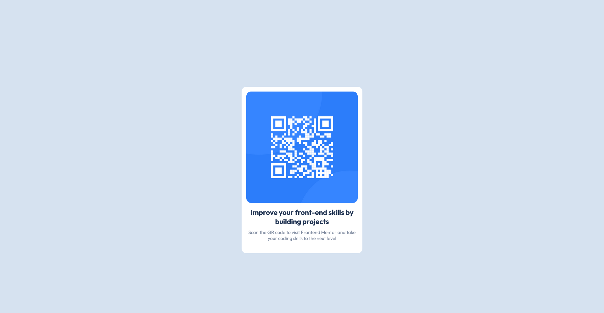
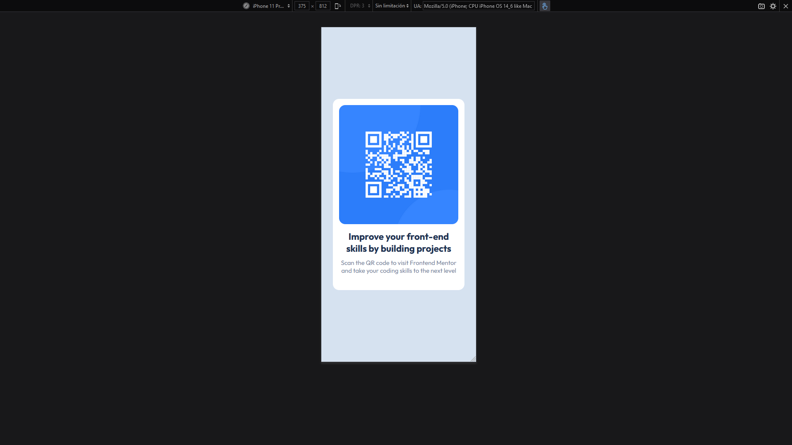

# Frontend Mentor - QR code component solution

This is a solution to the [QR code component challenge on Frontend Mentor](https://www.frontendmentor.io/challenges/qr-code-component-iux_sIO_H).

## Table of contents

- [Overview](#overview)
  - [Links](#links)
  - [Screenshot](#screenshot)
- [My process](#my-process)
  - [Built with](#built-with)
  - [What I learned](#what-i-learned)
  - [Continued development](#continued-development)
  - [Useful resources](#useful-resources)
- [Author](#author)

**Note: Delete this note and update the table of contents based on what sections you keep.**

## Overview

### Links

- Solution URL: [GitHub Repository](https://github.com/kutu-dev/qr-code-component)
- Live Site URL: [GitHub Pages](https://kutu-dev.github.io/qr-code-component/)

### Screenshot

#### Desktop

#### Mobile

## My process

### Built with

- Semantic HTML5 markup
- CSS custom properties
- Flexbox
- Mobile-first workflow

### What I learned

How to use `em` units to have relative margin and padding in a really easy way.

### Continued development

Learn more about accessibility in HTML and WAI-ARIA.

### Useful resources

- [ Mozilla Developer Network ](https://developer.mozilla.org/es/)

## Author

Create with :heart: by [Kutu](https://github.com/kutu-dev).

> - GitHub - [kutu-dev](https://github.com/kutu-dev)
> - Frontend Mentor - [@kutu-dev](https://www.frontendmentor.io/profile/kutu-dev)
